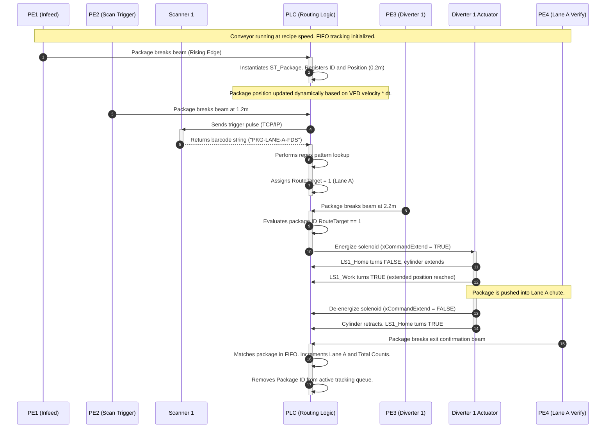
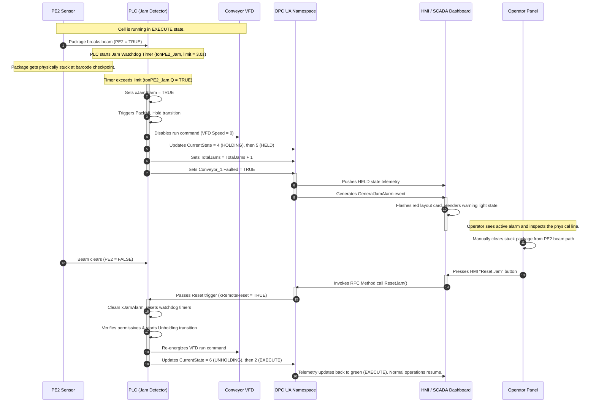

# Functional Design Specification (FDS)
## Material Handling Micro Cell (MHMC-01)

**Document Ref:** FDS-MHMC-001  
**Version:** 2.0.0  
**Author:** Lead Automation Engineer (MIT Graduate)  
**Date:** June 24, 2026  
**Status:** Approved for Implementation  

---

## 1. Overview & System Objectives
The **Material Handling Micro Cell (MHMC-01)** is a high-speed sorting and verification cell designed for intralogistics fulfillment. The primary objective is to route packages from an inflow conveyor to designated destination lanes based on vision-based barcode inspection, while providing comprehensive diagnostic capabilities, safety integration, and real-time state mirroring to a SCADA system and Digital Twin.

### Key System Objectives:
- **Throughput:** Process and sort up to 60 packages per minute.
- **Accurate Routing:** Inspect barcodes and divert packages to Lane A, Lane B, or the Reject Lane.
- **Diagnostics:** Implement jam detection timers and tracking to isolate blockages.
- **Standardized State Machine:** Utilize the PackML (ISA-TR88.00.02) standard for control modes and states.
- **Data Integration:** Expose all data via OPC UA to support a SCADA client (Grafana/InfluxDB) and a Digital Twin.

---

## 2. Physical Layout & Component Mapping
The MHMC-01 cell consists of a three-section conveyor array, a vision-based barcode checkpoint, two pneumatic diverters, and six photoelectric sensors.

```
       +---------------------------------------------------------+
       |                       Conveyor 1                        |
 =====> | [PE1]                      [PE2]                [PE3]   | =====> (Main Flow)
       +------------------------------|--------------------|-----+
                                      |                    |
                                 [Scanner 1]          [Diverter 1]
                                                           |
                                                           v
                                                      +----------+
                                                      |  Lane A  | [PE4]
                                                      +----------+
                                                           |
                                                      [Diverter 2]
                                                           |
                                                           v
                                                      +----------+
                                                      |  Lane B  | [PE5]
                                                      +----------+
                                                           |
                                                           v
                                                      +----------+
                                                      |  Reject  | [PE6]
                                                      +----------+
```

### Physical Hardware Mapping:
1. **Conveyor 1 (Infeed & Main Line):** Powered by an AC induction motor driven by a Variable Frequency Drive (VFD) communicating via PROFINET.
2. **Diverter 1 (Pneumatic Pusher):** High-speed solenoid-controlled pneumatic cylinder with magnetic proximity sensors for home/retracted (`LS1_Home`) and extended (`LS1_Work`) positions. Routes to Lane A.
3. **Diverter 2 (Pneumatic Pusher):** Identical to Diverter 1. Routes to Lane B.
4. **Scanner 1 (Vision Checkpoint):** Raster laser or area sensor communicating over TCP/IP (Modbus TCP), reading 1D/2D barcodes.
5. **Photoelectric Sensors (PEs):**
    * `PE1` (Infeed Sensor): Detects package arrival and starts tracking.
    * `PE2` (Trigger Sensor): Prompts Scanner 1 to trigger and capture barcode.
    * `PE3` (Diverter 1 In-range): Detects when a package is positioned directly in front of Diverter 1.
    * `PE4` (Lane A Verification): Confirms successful divert into Lane A.
    * `PE5` (Lane B Verification): Confirms successful divert into Lane B.
    * `PE6` (Reject/Default Verification): Confirms package reached the Reject Lane.

---

## 3. High-Level System Architecture
The control and supervision pipeline utilizes a decoupled, open-standard industrial automation stack. The physical cell (or its virtual Software-in-the-Loop equivalent) publishes real-time telemetry to an OPC UA address space, which is then historicalized and visualized.

```mermaid
flowchart TB
    %% Nodes
    subgraph Physical_Cell ["Physical Cell / Digital Twin (Python Sim)"]
        Sensors["Sensors (PE1-PE6, Proximity Switches)"]
        Actuators["Actuators (Conveyor VFD, Diverter Solenoids)"]
        Scanner["Vision Barcode Scanner"]
    end

    subgraph Control_Layer ["PLC Control Layer (IEC 61131-3)"]
        StationController["Station Controller (PackML ST)"]
        DiverterController["Diverter Controller"]
        JamDetector["Jam Detector Watchdogs"]
        RoutingLogic["FIFO Routing & Queue Logic"]
    end

    subgraph Middleware ["OPC UA Server (Middleware)"]
        OPCServer["OPC UA Address Space (ns=2)"]
    end

    subgraph SCADA_Layer ["Telemetry & Historian Stack"]
        Telegraf["Telegraf Collector (OPC UA Input)"]
        InfluxDB[("InfluxDB Time-Series DB")]
        Grafana["Grafana SCADA Dashboard"]
    end

    subgraph Supervisor ["Line Supervisor"]
        LineSupervisor["Line Supervisor Service / Operator HMI"]
    end

    %% Interactions
    Sensors -->|Hardwired I/O / Fieldbus| Control_Layer
    Control_Layer -->|Solenoid & VFD Control| Actuators
    Scanner -->|Modbus TCP| Control_Layer
    
    Control_Layer <==>|Internal Memory Map| OPCServer
    Physical_Cell <==>|SIL OPC UA Sync Loop (50ms)| OPCServer
    
    OPCServer -->|Poll / Subscribe (100ms)| Telegraf
    Telegraf -->|Line Protocol (Write)| InfluxDB
    InfluxDB -->|Flux Queries| Grafana
    
    LineSupervisor <==>|RPC Methods & Overrides| OPCServer
```

---

## 4. Detailed Module Specifications

### 4.1 Line Supervisor
- **Responsibility:** Orchestrates cell-level operations, dispatches product recipes (target speeds and routing matching patterns), coordinates with enterprise SCADA/MES systems, and provides HMI command interfaces for operator overrides.
- **Interfaces:**
  - **Inputs:** Operator command inputs (Start, Stop, Reset, Mode Select, Recipe Select).
  - **Outputs:** Recipe configuration dispatches (Target Speed, Barcode match patterns).
  - **OPC UA Mappings:** Calls OPC UA RPC Methods (`StartCell`, `StopCell`, `LoadRecipe`). Writes to `CurrentMode` node.

### 4.2 Station Controller
- **Responsibility:** Implements the core **PackML (ISA-TR88.00.02)** state engine. It manages the line's start/stop logic, executes phase state transitions, tracks cycle execution times, and coordinates logical permissions across all sub-components.
- **Interfaces:**
  - **Inputs:** Physical inputs (Safety loop healthy, air pressure switch), sub-system faults, and Line Supervisor command flags.
  - **Outputs:** Control signals to start/stop the conveyor VFD and run routing sequences.
  - **OPC UA Mappings:** Exposes `CurrentState` (PackML_State_Enum) and `PermissivesOK` (Boolean) nodes.

### 4.3 Diverter Controller
- **Responsibility:** Controls physical high-speed solenoids for Diverter 1 and Diverter 2 pneumatic cylinders. It monitors magnetic limit switches (`LSx_Home`, `LSx_Work`) to verify transit time and generates alarms if actuators fail to move.
- **Interfaces:**
  - **Inputs:** Proximity sensors (`xHomeSensor`, `xWorkSensor`) and exit confirmation photocells (`PE4`, `PE5`).
  - **Outputs:** 24VDC digital output to pneumatic solenoid valves (`xCommandExtend`).
  - **OPC UA Mappings:** Exposes variables under `DeviceSet.Diverter_x.*` (Home, Work, CommandExtend, PE_Verify, Faulted).

### 4.4 Jam Detector
- **Responsibility:** Runs parallel software watchdog timers on all photoelectric sensors (`PE1`, `PE2`, `PE3`). Detects blockages by comparing sensor blocked times against dynamic limits calculated based on conveyor speed.
- **Interfaces:**
  - **Inputs:** Raw photoelectric sensor inputs (`xRawPE1`, `xRawPE2`, `xRawPE3`) and conveyor speed feedback.
  - **Outputs:** Fault flags to the Station Controller (`xJamAlarm`) and stack light control outputs (flashing yellow beacon).
  - **OPC UA Mappings:** Exposes `TotalJams` counter node and triggers the `GeneralJamAlarm` OPC UA event.

### 4.5 Asset Model / OPC UA Namespace
- **Responsibility:** Structurally organizes all variables, data types, and callable procedures under the `http://antigravity.automation.org/MHMC/` (index `ns=2`) namespace. Serves as the single source of truth for HMI, SCADA, and the Digital Twin.
- **Interfaces:**
  - **Inputs/Outputs:** Full read/write register maps.
  - **Detailed OPC UA Node Table:**
    See [OPC UA Namespace Design Document](file:///c:/Users/chand/.gemini/antigravity/scratch/material_handling_cell/docs/opc_ua_namespace_design.md) for full descriptions of nodes under `DeviceSet`, `ControlState`, `KPIs`, and `Methods`.

### 4.6 Historian Connector
- **Responsibility:** Establishes a persistent connection to the OPC UA server via a Telegraf agent, polling variables every 100ms or subscribing to change events. It converts values into line protocol format and writes to InfluxDB.
- **Interfaces:**
  - **Inputs:** OPC UA node subscription data stream.
  - **Outputs:** Industrial Line Protocol payloads via HTTPS (Port 8086) to InfluxDB.
  - **Database Schema Mapping:**
    * `conveyor_telemetry`: speed feedback, setpoint, motor current, sensor states.
    * `diverter_telemetry`: home/work switches, solenoid commands, verification states.
    * `sorting_events`: package barcodes, assigned routing lanes, read statuses.
    * `cell_kpis`: aggregates of throughput counts, current OEE metrics.
    * `alarms_events`: alarm activation flags, severities, and error messages.

### 4.7 KPI Service
- **Responsibility:** Tracks production counters (Total packages, Lane A, Lane B, Reject) and calculates real-time **Overall Equipment Effectiveness (OEE)** using three factors: Machine Availability, Performance Rate, and Quality Yield.
- **Interfaces:**
  - **Inputs:** Divert and verification sensor transitions (`PE4`, `PE5`, `PE6`), state duration timers.
  - **Outputs:** Calculated KPI data structures.
  - **OEE Formulas:**
    $$\text{Availability} = \frac{\text{Uptime (Execute State)}}{\text{Scheduled Time (Uptime + Fault Downtime)}}$$
    $$\text{Performance} = 0.96 \quad (\text{Target sorting velocity efficiency})$$
    $$\text{Quality} = \frac{\text{Total Packages} - \text{Reject Packages}}{\text{Total Packages}}$$
    $$\text{OEE (\%)} = \text{Availability} \times \text{Performance} \times \text{Quality} \times 100.0$$

### 4.8 Alarm/Event Manager
- **Responsibility:** Monitors system conditions, categorizes faults, flags active alarms to SCADA, handles acknowledgment logic, and controls local warning indicators (stack light beacon).
- **Interfaces:**
  - **Inputs:** PLC error flags, safety relay transitions, and sensor watchdogs.
  - **Outputs:** Sounder alarm output and 3-color stack light control (Green = Run, Flashing Yellow = Jam/Hold, Red = E-Stop/Abort).
  - **OPC UA Mappings:** Exposes instances of `AlarmConditionType` (GeneralJamAlarm, Diverter1Fault, Diverter2Fault, EStopTripped).

---

## 5. System Operation Modes & States (PackML)

### 5.1 System Operation Modes
1. **Automatic (Auto):** Full sequence execution. Conveyor operates at speeds determined by the recipe; vision scanner reads barcodes and dispatches diversion targets automatically; all safety and jam watchdogs are fully active.
2. **Manual:** Direct control of individual hardware components. Operator can jog the conveyor VFD via HMI sliders, manually fire pneumatic pushers to clear obstructions, and command physical scanner test triggers.
3. **Maintenance:** Engineering level access. Allows speed override and VFD current diagnostics, sensor alignment testing, tuning of pneumatic extend/retract watchdog thresholds, and local simulation adjustments.

### 5.2 PackML States Table
The system logic follows the ISA-TR88.00.02 standard, executing the following states:

| State | State Type | Description |
| :--- | :--- | :--- |
| **STOPPED** | Stopped | Conveyor motor is disabled. Actuator solenoids are de-energized. System is waiting for a `Reset` command. |
| **RESETTING** | Transition | Retracts cylinders to home position. Resets active alarm registers. Verifies system safety and ready status. |
| **IDLE** | Active | System permissives are healthy. Cell is waiting for a `Start` command. |
| **STARTING** | Transition | VFD conveyor motor begins ramping up. Barcode scanner ping checks clear. System transitions to `EXECUTE`. |
| **EXECUTE** | Active | Normal operation. Packages are ingested, scanned, and diverted. |
| **SUSPENDED** | Active | Conveyor stops due to downstream block (e.g. Lanes A/B full). Package tracking arrays are preserved. Auto-resumes. |
| **HOLDING** | Transition | A non-safety diagnostic fault (e.g., package jam) has been detected. Conveyor decelerates to a stop. |
| **HELD** | Active | Cell is stopped. Yellow beacons flash. System waits for operator clearing and manual `ResetJam` command. |
| **UNHOLDING** | Transition | Safe conditions verified. VFD restarts. Conveyor ramps up and shifts back into `EXECUTE`. |
| **STOPPING** | Transition | Controlled stop sequence. Any package in-flight is cleared past exit sensors before VFD stops. |
| **ABORTED** | Stopped | E-stop pressed or door interlock broken. STO (Safe Torque Off) removes power from VFD and pneumatics. |

---

## 6. Key State Transitions & Sequence Diagrams

### 6.1 Line Start Permissives
To transition the PackML state from `IDLE` to `STARTING`, the following logical expression must evaluate to `TRUE`:

$$\text{PermissivesOK} = \text{SafetyLoopOK} \land \text{AirPressureOK} \land \text{VFD\_Ready} \land \neg \text{Diverter1\_Faulted} \land \neg \text{Diverter2\_Faulted}$$

Where:
- $\text{SafetyLoopOK} = \text{TRUE}$ (All E-Stops and guard doors closed).
- $\text{AirPressureOK} = \text{TRUE}$ (Pneumatic pressure switch reads $\ge 5.5 \text{ bar}$).
- $\text{VFD\_Ready} = \text{TRUE}$ (Main conveyor drive reports no internal faults).
- $\text{Diverter\_Faulted} = \text{FALSE}$ (Limit switches verify pushers are retracted home).

---

### 6.2 Normal Operation Sequence
Below is the execution flow of a package successfully moving through the cell under automatic operation:



---

### 6.3 Jam Detection & Recovery Sequence
The sequence diagram below displays the timing, transitions, and communication steps during a conveyor jam and subsequent operator recovery:



---

## 7. Digital Twin State Mirroring Strategy

### 7.1 Software-in-the-Loop Concept
The MHMC-01 Digital Twin is developed in Python (`digital_twin/sim_engine.py`) as a high-fidelity **Software-in-the-Loop (SIL)** simulation. Rather than mocking signals with simple toggles, the simulation calculates mechanical and pneumatic equations in real time. It acts as the master OPC UA server, exposing physical variables so that PLC control logic, SCADA database collectors, and HMI overlays interact with identical nodes as they would on a real factory floor.

---

### 7.2 Kinematic Modeling & Physics
The simulator maps the conveyor line as a one-dimensional coordinate line starting at $x = 0.0 \text{ meters}$ and terminating at $x = 4.2 \text{ meters}$.

#### VFD Motor Inertia Lag
To match physical motor acceleration curves, the conveyor velocity $v_{\text{conv}}(t)$ is simulated as a lag filter responding to speed setpoint changes $v_{\text{set}}(t)$, governed by time constant $\tau = 0.4 \text{ seconds}$:

$$v_{\text{conv}}(t + \Delta t) = v_{\text{conv}}(t) + \left(\frac{v_{\text{set}}(t) - v_{\text{conv}}(t)}{\tau}\right) \Delta t$$

#### Package Position Integration
Each spawned virtual package $i$ has a coordinate position $x_i$ and a length $W_{\text{pkg}} = 0.25 \text{ meters}$. If the conveyor is active and the package is not physically jammed, its coordinate moves according to:

$$x_i(t + \Delta t) = x_i(t) + v_{\text{conv}}(t) \cdot \Delta t$$

#### Sensor Beam Calculations
Photoelectric sensors are placed at fixed coordinates along the line. A sensor $PE_k$ at position $x_{\text{PE\_k}}$ changes to `TRUE` if any portion of a package overlaps its coordinate:

$$\text{SensorState}(PE_k) = \begin{cases} 
\text{TRUE} & \text{if } \exists i \text{ s.t. } x_i(t) \le x_{\text{PE\_k}} \le (x_i(t) + W_{\text{pkg}}) \\
\text{FALSE} & \text{otherwise}
\end{cases}$$

---

### 7.3 Actuator Dynamics (Pneumatic Diverters)
Pneumatic cylinders are simulated with mass transit times.
- **Transit Velocity:** The piston moves at a stroke speed of $0.43 \text{ m/s}$, taking exactly $t_{\text{transit}} = 0.35 \text{ seconds}$ to span its full stroke of $0.15 \text{ meters}$.
- **Limit Switch States:** 
  - If piston position $d \le 0.01 \text{ m}$, `LS_Home` = `TRUE`, `LS_Work` = `FALSE`.
  - If piston position $d \ge 0.14 \text{ m}$, `LS_Home` = `FALSE`, `LS_Work` = `TRUE`.
  - During transit, both limit switches read `FALSE`.

---

### 7.4 OPC UA Synchronization Loop
The Digital Twin runs an asynchronous simulation loop executing every $50 \text{ milliseconds}$ ($\Delta t = 0.05$).
1. **Read Step:** Queries the OPC UA namespace for speed setpoints and diverter solenoids commanded by the PLC or HMI.
2. **Physics Step:** Computes motor speed, integrates package coordinates, checks sensor beam breaks, and shifts cylinder strokes.
3. **Write Step:** Overwrites feedback variables (motor feedback speed, currents, photoelectric beams, limit switches) and triggers scanner strings.

---

### 7.5 Anomaly Injection Framework
To validate error recovery and alarm notification pathways, the simulation provides an interactive interface to inject faults:

- **Package Jam (Main Conveyor):** Freezes the position of package $i$ when it reaches $x_{\text{PE2}} = 1.2 \text{ meters}$. This forces `PE2` to remain blocked, testing the PLC's 3.0s watchdog timer and the SCADA alarm generation.
- **Diverter Stroke Failure:** Lock cylinder position at $0.05 \text{ meters}$ during transit (mid-stroke mechanical failure). Tests the PLC's 0.8s travel limit fault and safe stop transition.
- **Vision Scanner Timeout/Dirty Lens:** When a package triggers the scan zone, the simulator returns "BAD-SCAN" string, forcing the PLC to direct the package to the reject lane.

---

## 8. Safety Interlocks & Hazards Matrix

| Hazard / Scenario | Sensor / Input | Safety Loop Action | PLC State Transition | Mechanical Safe State | Recovery Requirement |
| :--- | :--- | :--- | :--- | :--- | :--- |
| **Emergency Stop Pressed** | Dual-channel E-Stop buttons | Instantly breaks hardware safety loop. | `ABORTED` (Instant) | Safe Torque Off (STO) to conveyor VFD. Air dumped from pneumatic manifolds. | Re-engage physical button + Press HMI Reset. |
| **Safety Gate Opened** | RFID Interlocks | Instantly breaks hardware safety loop. | `ABORTED` (Instant) | VFD STO active. Actuator cylinders de-energized. | Close gate + Press HMI Reset. |
| **Pneumatic Pressure Drop** | Digital Switch ($< 5.0 \text{ bar}$) | Logic interlock tripped (Software level). | `HOLDING` -> `HELD` | VFD deceleration to quick stop. Diverter valves disabled. | Restore pressure $\ge 5.5 \text{ bar}$ + Press HMI Reset. |
| **Conveyor VFD Overload** | VFD internal fault contact | Logic fault trip. | `HOLDING` -> `HELD` | Conveyor quick stop. Diverters disabled. | Investigate VFD diagnostics + Press HMI Reset. |
| **Pneumatic Actuator Stuck** | Proximity limit switches | Logic watchdog trip (Travel $>$ 0.8s). | `HOLDING` -> `HELD` | Conveyor quick stop. De-energize solenoid valve. | Manually clear obstruction + Press HMI Reset. |
